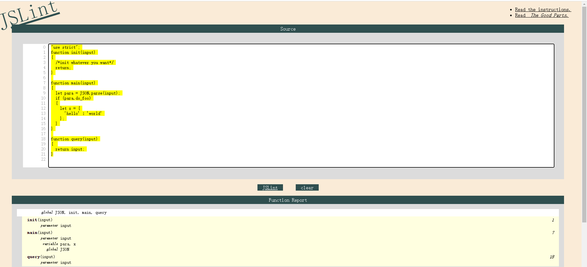
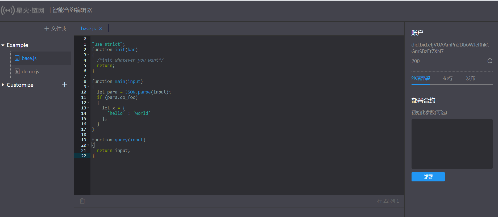
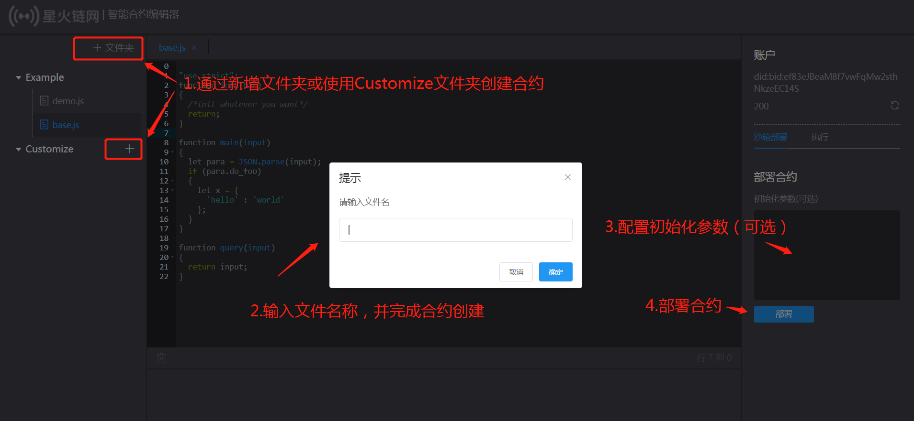
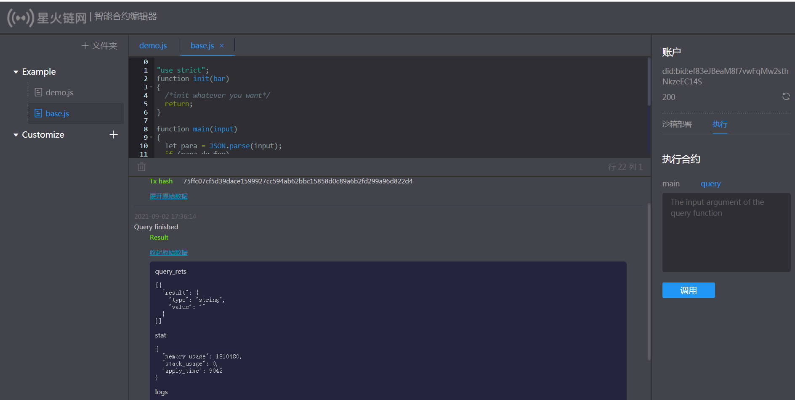

# 2. JavaScript智能合约开发

## 2.1 JavaScript智能合约描述

JavaScript智能合约是一段 JavaScript 代码，标准(ECMAScript as specified in ECMA-262)，使用Spark-V8引擎。

合约结构分为如下三段。合约上链部署完成后，合约文本会直接存储到合约账户结构中。 

合约的初始化函数是 `init`, 合约部署时自动由虚拟机引擎直接调用init进行合约账户数据的初始化。

合约执行的入口函数是 `main`函数，main中可实现不同的功能接口，并通过参数字符串input选择不同接口。main函数入口仅支持合约调用者以**星火交易**方式进行调用，内部功能接口可实现合约数据存储相关操作。（可实现读写功能）

合约查询接口是 `query`函数，query中可实现不同的查询功能接口，并通过参数字符串input选择不同接口。query函数入口仅支持合约调用者以**查询接口**进行调用，内部功能接口可用于合约账户中数据的读取，禁止进行合约数据存储相关操作。调用过程不需消耗星火令。(只读功能)

下面是一个简单的例子：

```javascript
"use strict";
function init(input)
{
  /*init whatever you want*/
  return;
}

function main(input)
{
  let para = JSON.parse(input);
  if (para.do_foo)
  {
    let x = {
      'hello' : 'world'
    };
  }
}

function query(input)
{ 
  return input;
}
```


## 2.2 星火链预编译JavaScript指令

为星火链JavaScript智能合约的高效执行，星火链实现了部分预编译JavaScript指令，可通过智能合约直接进行调用。

智能合约内提供了全局对象 `Chain` 和 `Utils`, 这两个对象提供了多样的方法和变量，可以获取区块链的一些信息，也可驱动账号发起交易。

**注意，自定义的变量不要与内置对象重复，否则会造成不可控的数据错误。**

### 2.2.1 属性说明

+ **使用方法**

  对象.方法(变量)

  接口举例：

  + 获取账号余额：`Chain.getBalance('did:bid:efAsXt5zM2Hsq6wCYRMZBS5Q9HvG2EmK');`
  + 打印日志：`Utils.log('hello');`
  + 当前区块号：`Chain.block.number;`

+ **读写权限**
  + 对象里的每个函数都有固定的**只读**或者**可写**权限

  + 只读权限是指**不会写数据到区块链**的接口函数，比如获取余额 `Chain.getBalance`

  + 可写权限是指**会写数据到区块链**的接口函数，比如转账 `Chain.payCoin`

  + 在编写智能合约的时候，需要注意的是不同的入口函数拥有不同的调用权限

  + `init` 和 `main` 能调用所有的内置函数

  + `query`  只能调用只读权限的函数，否则在调试或者执行过程中会提示接口未定义

+ **返回值介绍**

  所有内部函数的调用，如果失败则返回 false 或者直接抛出异常执行终止，成功则返回其对象。如果遇到参数错误，会在错误描述中提示参数位置出错。

### 2.2.2 接口对象

#### 2.2.2.1 Chain 对象方法列表

| 方法                                                      | 说明                       |
| --------------------------------------------------------- | -------------------------- |
| Chain.load(metadata_key)                                  | 获取合约账号的metadata信息 |
| Chain.store(metadata_key, metadata_value)                 | 存储合约账号的metadata信息 |
| Chain.del(metadata_key)                                   | 删除合约账号的metadata信息 |
| Chain.getBlockHash(offset_seq)                            | 获取区块信息               |
| Chain.tlog(topic,args...)                                 | 输出交易日志               |
| Chain.getAccountMetadata(account_address, metadata_key)   | 获取指定账号的metadata信息 |
| Chain.getBalance(address)                                 | 获取账号coin amount        |
| Chain.getAccountPrivilege(account_address)                | 获取某个账号的权限信息     |
| Chain.getContractProperty(contract_address)               | 获取合约账号属性           |
| Chain.payCoin(address, amount[, input], [, metadata])     | 转账                       |
| Chain.delegateCall(contractAddress, input)                | 委托调用                   |
| Chain.delegateQuery(contractAddress, input)               | 委托查询                   |
| Chain.contractCall(contractAddress, asset, amount, input) | 调用合约                   |

- 获取合约账号的metadata信息

  `Chain.load(metadata_key);`

  即可得到本合约账号中自定数据的abc的值。

  | 参数         | 说明          |
  | ------------ | ------------- |
  | metadata_key | metadata的key |

  ```javascript
  let value = Chain.load('abc');
  /*
    权限：只读
    返回：成功返回字符串，如 'values', 失败返回false
  */
  
  ```

- 存储合约账号的metadata信息

  `Chain.store(metadata_key, metadata_value);`

  | 参数           | 说明              |
  | -------------- | ----------------- |
  | metadata_key   | metadata的key     |
  | metadata_value | metadata 的 value |

  ```javascript
  Chain.store('abc', 'values');
  /*
    权限：可写
    返回：成功返回true, 失败抛异常
  */
  
  ```

- 删除合约账号的metadata信息

  `Chain.del(metadata_key);`

  即可删除本合约账号中自定数据的abc的值。

  | 参数         | 说明          |
  | ------------ | ------------- |
  | metadata_key | metadata的key |

  ```javascript
  Chain.del('abc');
  /*
    权限：可写
    返回：成功返回true, 失败抛异常
  */
  
  ```

- 获取区块信息

  `Chain.getBlockHash(offset_seq);`

  | 参数       | 说明                                     |
  | ---------- | ---------------------------------------- |
  | offset_seq | 距离最后一个区块的偏移量，范围：[0,1024) |

  ```javascript
  let ledger = Chain.getBlockHash(4);
  /*
    权限：只读
    返回：成功返回字符串，如 'c2f6892eb934d56076a49f8b01aeb3f635df3d51aaed04ca521da3494451afb3'，失败返回 false
  */
  
  ```

- 输出交易日志

  `Chain.tlog(topic,args...);`

  tlog会产生一笔交易写在区块上。

  | 参数    | 说明                                                         |
  | ------- | ------------------------------------------------------------ |
  | topic   | 日志主题，必须为字符串类型,参数长度(0,128]                   |
  | args... | 最多可以包含5个参数，参数类型可以是字符串、数值或者布尔类型,每个参数长度(0,1024] |

  ```javascript
  Chain.tlog('transfer',sender +' transfer 1000',true);
  /*
    权限：可写
    返回：成功返回 true，失败抛异常
  */
  ```

- 获取指定账号的metadata

  `Chain.getAccountMetadata(account_address, metadata_key);`

  | 参数            | 说明          |
  | --------------- | ------------- |
  | account_address | 账号地址      |
  | metadata_key    | metadata的key |

  ```javascript
  let value = Chain.getAccountMetadata('did:bid:efAsXt5zM2Hsq6wCYRMZBS5Q9HvG2EmK', 'abc');
  
  /*
    权限：只读
    返回：成功返回字符串，如 'values', 失败返回false
  */
  ```

- 获取账号coin amount

  `Chain.getBalance(address);`

  | 参数    | 说明     |
  | ------- | -------- |
  | address | 账号地址 |

  ```javascript
  let balance = Chain.getBalance('did:bid:efAsXt5zM2Hsq6wCYRMZBS5Q9HvG2EmK');
  /*
    权限：只读
    返回：字符串格式数字 '9999111100000'
  */
  ```

- 获取某个账号的权限信息

  `Chain.getAccountPrivilege(account_address);`

  | 参数            | 说明     |
  | --------------- | -------- |
  | account_address | 账号地址 |

  ```javascript
  let privilege = Chain.getAccountPrivilege('did:bid:efAsXt5zM2Hsq6wCYRMZBS5Q9HvG2EmK');
  
  /*
    权限：只读
    返回：成功返回权限json字符串如'{"master_weight":1,"thresholds":{"tx_threshold":1}}'，失败返回 falses
  */
  ```

- 获取合约账号属性

  `Chain.getContractProperty(contract_address);`

  | 参数             | 说明     |
  | ---------------- | -------- |
  | contract_address | 合约地址 |

  ```javascript
  let value = Chain.getContractProperty('did:bid:efAsXt5zM2Hsq6wCYRMZBS5Q9HvG2EmK');
  
  /*
    权限：只读
    返回：成功返回JSON对象，如 {"type":0, "length" : 416},  type 指合约类型， length 指合约代码长度，如果该账户不是合约则，length 为0.
    失败返回false
  */
  ```

- 转账

  `Chain.payCoin(address, amount[, input], [, metadata]);`

  | 参数     | 说明                                                         |
  | -------- | ------------------------------------------------------------ |
  | address  | 发送星火令的目标地址                                             |
  | amount   | 发送星火令的数量                                                 |
  | input    | 可选，合约参数，如果用户未填入，默认为空字符串               |
  | metadata | 可选，转账备注，显示为十六进制字符串，需要转换为明文 |

  ​		注意，如果提供metadata参数，那么也必须提供input参数，否则内置接口无法区分该参数是谁，因为两者都是可选的。如果没有input，可以传入空字符串**""**占位,以防止内置接口将metadata参数误认为inut参数。

  ```javascript
  Chain.payCoin("did:bid:efAsXt5zM2Hsq6wCYRMZBS5Q9HvG2EmK", "10000", "", "vote reward");
  /*
    权限：可写
    返回：成功返回 true，失败抛异常  
  */
  ```

- 委托调用

  `Chain.delegateCall(contractAddress, input);`

  | 参数            | 说明             |
  | --------------- | ---------------- |
  | contractAddress | 被调用的合约地址 |
  | input           | 调用参数         |

  `Chain.delegateCall` 函数会触发被调用的合约`main`函数入口，并且把当前合约的执行环境赋予被调用的合约。如合约A委托调用合约B，即执行B(main入口)的代码，读写A的数据。

  ```javascript
  let ret = Chain.delegateCall('did:bid:efAsXt5zM2Hsq6wCYRMZBS5Q9HvG2EmK'，'{}');
  /*
    权限：可写
    返回：成功会返回被委托者合约main函数执行的结果，失败抛出异常
  */
  
  ```

- 委托查询

  `Chain.delegateQuery(contractAddress, input);`

  | 参数            | 说明             |
  | --------------- | ---------------- |
  | contractAddress | 被调用的合约地址 |
  | input           | 调用参数         |

  `Chain.delegateQuery` 函数会触发被调用的合约`query`函数入口，且把当前合约的执行环境赋予被调用的合约。如合约A委托查询合约B，即执行B(query入口)的代码，读取A的数据。

  ```javascript
  let ret = Chain.delegateQuery('did:bid:efAsXt5zM2Hsq6wCYRMZBS5Q9HvG2EmK'，"");
  /*
    权限：只读
    返回：调用成功则返回JSON对象 {"result":"4"}，其中 result 字段的值即查询的具体结果，调用失败返回JSON对象 {"error":true} 。
  */
  
  ```

- 调用合约

  `Chain.contractCall(contractAddress, asset, amount, input);`

  | 参数            | 说明                       |
  | --------------- | -------------------------- |
  | contractAddress | 被调用的合约地址           |
  | asset           | 仅支持传入true，代表星火令 |
  | amount          | 星火令数量                 |
  | input           | 调用参数                   |

  `Chain.contractCall` 函数会触发被调用的合约`main`函数入口。

  ```javascript
  let ret = Chain.contractCall('did:bid:efAsXt5zM2Hsq6wCYRMZBS5Q9HvG2EmK'，true, toBaseUnit("10"), "");
  /*
    权限：可写
    返回：如果目标账户为普通账户，则返回true，如果目标账户为合约，成功会返回被委托者合约main函数执行的结果，调用失败则抛出异常
  */
  
  ```

- 查询合约

  `Chain.contractQuery(contractAddress, input);`

  | 参数            | 说明             |
  | --------------- | ---------------- |
  | contractAddress | 被调用的合约地址 |
  | input           | 调用参数         |

  `Chain.contractQuery` 会调用合约的查询接口。

  ```javascript
  let ret = Chain.contractQuery('did:bid:efAsXt5zM2Hsq6wCYRMZBS5Q9HvG2EmK'，"");
  /*
    权限：只读
    返回：调用成功则返回JSON对象 {"result":"xxx"}，其中 result 字段的值即查询的具体结果，调用失败返回JSON对象 {"error":true}。
  */
  
  ```

- 创建合约

  `Chain.contractCreate(balance, type, code, input);`

  | 参数        | 说明                                   |
  | ----------- | -------------------------------------- |
  | balance     | 字符串类型，转移给被创建的合约的星火令 |
  | type        | 整型，0代表javascript                  |
  | code        | 字符串类型， 合约代码                  |
  | input：init | init函数初始化参数                     |

  `Chain.contractCreate` 创建合约。

  ```javascript
  let ret = Chain.contractCreate(toBaseUnit("10"), 0, "'use strict';function init(input){return input;} function main(input){return input;} function query(input){return input;} ", "");
  /*
    权限：可写
    返回：创建成功返回合约地址字符串，失败则抛出异常
  */
  
  ```

#### 2.2.2.2 Chain 对象变量列表

| 变量                     | 描述                         |
| ------------------------ | ---------------------------- |
| Chain.block.timestamp    | 当前区块的时间戳             |
| Chain.block.number       | 当前区块高度                 |
| Chain.tx.initiator       | 交易的发起者                 |
| Chain.tx.sender          | 交易的触发者                 |
| Chain.tx.gasPrice        | 交易的星火令价格             |
| Chain.tx.hash            | 交易hash值                   |
| Chain.tx.feeLimit        | 交易的限制费用               |
| Chain.msg.initiator      | 消息的发起者                 |
| Chain.msg.sender         | 消息的触发者                 |
| Chain.msg.nonce          | 本次交易消息发起者的nonce值  |
| Chain.msg.operationIndex | 触发本次合约调用的操作的序号 |
| Chain.thisAddress        | 当前合约账号的地址           |

+ 区块信息 Chain.block
  + 当前区块时间戳

    `Chain.block.timestamp`

    当前交易执行时候所在的区块时间戳。

  + 当前区块高度

    `Chain.block.number`

    当前交易执行时候所在的区块高度。

+ 交易 Chain.tx

  交易是用户签名的那笔交易信息。

  + 交易的发起者

    `Chain.tx.initiator`

     交易最原始的发起者，即交易的费用付款者。

  + 交易的触发者

    `Chain.tx.sender`

    交易最原始的触发者，即交易里触发合约执行的操作的账户。
    例如某账号发起了一笔交易，该交易中有个操作是调用合约Y（该操作的source_address是x），那么合约Y执行过程中，sender的值就是x账号的地址。

  ```javascript
  let bar = Chain.tx.sender;
  /*
  那么bar的值是x的账号地址。
  */
  ```

  + 交易的星火令价格

    `Chain.tx.gasPrice`

    交易签名里的星火令价格。

  + 交易的哈希值

    `Chain.tx.hash`

    交易的hash值

  + 交易的限制费用

    `Chain.tx.feeLimit`

+ 消息 Chain.msg

  消息是在交易里触发智能合约执行产生的信息。在触发的合约执行的过程中，交易信息不会被改变，消息会发生变化。例如在合约中调用`contractCall`，`contractQuery`的时候，消息会变化。

  + 消息的发起者

    `Chain.msg.initiator`

    本消息的原始的发起者账号。

  + 消息的触发者

    `Chain.msg.sender`

    本次消息的触发者账号。

    例如某账号发起了一笔交易，该交易中有个操作是调用合约Y（该操作的source_address是x），那么合约Y执行过程中，sender的值就是x账号的地址。

  ```javascript
  let bar = Chain.msg.sender;
  /*
  那么bar的值是x的账号地址。
  */
  ```

  + 本次交易里的发起者的nonce值

    `Chain.msg.nonce`。即`Chain.msg.initiator`账号的 nonce值。

  + 触发本次合约调用的操作的序号

    `Chain.msg.operationIndex`

    该值等于触发本次合约的操作的序号。

    例如某账号A发起了一笔交易tx0，tx0中第0（从0开始计数）个操作是给某个合约账户转移星火令（调用合约），那么`Chain.msg.operationIndex`的值就是0。

  ```javascript
  let bar = Chain.msg.operationIndex;
  /* bar 是一个非负整数*/
  ```

+ 当前合约账号的地址

  `Chain.thisAddress`

  该值等于该合约账号的地址。

  例如账号x发起了一笔交易调用合约Y，本次执行过程中，该值就是Y合约账号的地址。

  ```text
  let bar = Chain.msg.thisAddress;
  /*
  bar的值是Y合约的账号地址。
  */
  ```

#### 2.2.2.3 Utils 对象方法列表

| 方法                                        | 说明                 |
| ------------------------------------------- | -------------------- |
| Utils.log(info)                             | 输出日志             |
| Utils.stoI64Check(strNumber)                | 字符串数字合法性检查 |
| Utils.int64Add(left_value, right_value)     | 64位加法             |
| Utils.int64Sub(left_value, right_value)     | 64位减法             |
| Utils.int64Mul(left_value, right_value)     | 64位乘法             |
| Utils.int64Mod(left_value, right_value)     | 64位取模             |
| Utils.int64Div(left_value, right_value)     | 64位除法             |
| Utils.int64Compare(left_value, right_value) | 64位比较             |
| Utils.assert(condition[, message])          | 断言                 |
| Utils.sha256(data[, dataType])              | sha256计算           |
| Utils.toBaseUnit(value)                     | 变换单位             |
| Utils.addressCheck(address)                 | 地址合法性检查       |
| Utils.toAddress(public_key)                 | 公钥转地址           |

- 输出日志

  `Utils.log(info);`

  | 参数 | 说明     |
  | ---- | -------- |
  | info | 日志内容 |

  ```javascript
  let ret = Utils.log('hello');
  /*
    权限：只读
    返回：成功无返回值，会在对应的合约执行进程里，输出一段Trace级别的日志，如 V8contract log[bid:did:zfadxSZ7m6pkcWNb6rnMZncyTVHSb:hello]；失败返回 false。
  */
  ```

- 字符串数字合法性检查

  `Utils.stoI64Check(strNumber);`

  | 参数      | 说明           |
  | --------- | -------------- |
  | strNumber | 字符串数字参数 |

  ```javascript
  let ret = Utils.stoI64Check('12345678912345');
  /*
    权限：只读
    返回：成功返回 true，失败返回 false
  */
  
  ```

- 64位加法

  `Utils.int64Add(left_value, right_value);`

  | 参数        | 说明 |
  | ----------- | ---- |
  | left_value  | 左值 |
  | right_value | 右值 |

  ```javascript
  let ret = Utils.int64Add('12345678912345', 1);
  /*
    权限：只读
    返回：成功返回字符串 '12345678912346', 失败抛异常
  */
  
  ```

- 64位减法

  `Utils.int64Sub(left_value, right_value);`

  | 参数        | 说明 |
  | ----------- | ---- |
  | left_value  | 左值 |
  | right_value | 右值 |

  ```javascript
  let ret = Utils.int64Sub('12345678912345', 1);
  /*
    权限：只读
    返回：成功返回字符串 '123456789123464'，失败抛异常
  */
  
  ```

- 64位乘法

  `Utils.int64Mul(left_value, right_value);`

  | 参数        | 说明 |
  | ----------- | ---- |
  | left_value  | 左值 |
  | right_value | 右值 |

  ```javascript
  let ret = Utils.int64Mul('12345678912345', 2);
  /*
    权限：只读
    返回：成功返回字符串 '24691357824690'，失败抛异常
  */
  
  ```

- 64位取模

  `Utils.int64Mod(left_value, right_value);`

  | 参数        | 说明 |
  | ----------- | ---- |
  | left_value  | 左值 |
  | right_value | 右值 |

  ```javascript
  let ret = Utils.int64Mod('12345678912345', 2);
  /*
    权限：只读
    返回：成功返回字符串 '1'，失败抛异常
  */
  
  ```

- 64位除法

  `Utils.int64Div(left_value, right_value);`

  | 参数        | 说明 |
  | ----------- | ---- |
  | left_value  | 左值 |
  | right_value | 右值 |

  ```javascript
  let ret = Utils.int64Div('12345678912345', 2);
  /*
    权限：只读
    返回：成功返回 '6172839456172'，失败抛异常
  */
  
  ```

- 64位比较

  `Utils.int64Compare(left_value, right_value);`

  | 参数        | 说明 |
  | ----------- | ---- |
  | left_value  | 左值 |
  | right_value | 右值 |

  返回值：  1：左值大于右值； 0：等于； -1 ：小于。

  ```javascript
  let ret = Utils.int64Compare('12345678912345', 2);
  /*
    权限：只读
    返回：成功返回数字 1（左值大于右值），失败抛异常
  */
  
  ```

- 断言

  `Utils.assert(condition[, message]);`

  | 参数      | 说明                     |
  | --------- | ------------------------ |
  | condition | 断言变量                 |
  | message   | 可选，失败时抛出异常的消 |

  ```javascript
  Utils.assert(1===1, "Not valid");
  /*
    权限：只读
    返回：成功返回 true，失败抛异常  
  */
  ```

- sha256计算

  `Utils.sha256(data[, dataType]);`

  | 参数           | 说明                                                         |
  | -------------- | ------------------------------------------------------------ |
  | data           | 待计算hash的原始数据，根据dataType不同，填不同格式的数据     |
  | dataType：data | data 的数据类型，整数，可选字段，默认为0。0：base16编码后的字符串，如"61626364"；1：普通原始字符串，如"abcd"；2：base64编码后的字符串,如"YWJjZA=="。如果对二进制数据hash计算，建议使用base16或者base64编码 |

  返回值:  成功会hash之后的base16编码后的字符串，失败会返回 false。

  ```javascript
  let ret = Utils.sha256('61626364');
  /*
    权限：只读
    功能：对
    返回：成功返回64个字节的base16格式字符串 '88d4266fd4e6338d13b845fcf289579d209c897823b9217da3e161936f031589'，失败返回false
  */
  
  ```

- 变换单位

  `Utils.toBaseUnit(value);`

  | 参数  | 说明                                                         |
  | ----- | ------------------------------------------------------------ |
  | value | 被转换的数字，只能传入字符串，可以包含小数点，且小数点之后最多保留 8 位数字 |

  返回值: 成功会返回乘以 10^8 的字符串，失败会返回 false。

  ```javascript
  let ret = Utils.toBaseUnit('12345678912');
  /*
    权限：只读
    返回：成功返回字符串 '1234567891200000000'，失败抛异常
  */
  
  ```

- 地址合法性检查

  `Utils.addressCheck(address);`

  | 参数    | 说明             |
  | ------- | ---------------- |
  | address | 地址参数，字符串 |

  ```javascript
  let ret = Utils.addressCheck('bid:did:zfadxSio3m7C7D84GzgmtTXa9azQB');
  /*
    权限：只读
    返回：成功返回 true，失败返回 false
  */
  
  ```

- 公钥转地址

  `Utils.toAddress(public_key);`

  | 参数       | 说明                     |
  | ---------- | ------------------------ |
  | public_key | 公钥，base16编码的字符串 |

  返回值：成功，返回账号地址；失败返回false。

  ```javascript
  let ret = Utils.toAddress('b0014e067cdae290c47a558cd0438e6361d11b2cf48863be1cde030fe0a41ae23eff8e1533a1');
  /*
    权限：只读
    返回：成功返回 "bid:did:zfadxSio3m7C7D84GzgmtTXa9azQB"，失败返回false
  */
  
  ```

### 2.2.3 异常处理

- JavaScript异常

  当合约运行中出现未捕获的JavaScript异常时，处理规定：

  * 本次合约执行失败，合约中做的所有交易都不会生效。

  * 触发本次合约的这笔交易为失败。错误代码为`151`。

- 执行交易失败

  合约中可以执行多个交易，只要有一个交易失败，就会抛出异常，导致整个交易失败

## 2.3 星火链合约SQL接口

​		星火链支持在JavaScript智能合约中直接编写SQL语句，对MySQL数据库进行操作。

### 2.3.1 SQL语句分类

​		在星火链JavaScript智能合约中，允许执行的SQL语句分为三类：

| 语句类型                | 可用语句关键字                   |
| ----------------------- | -------------------------------- |
| 数据结构定义语句（DDL） | CREATE ALTER DROP TRUNCATE TABLE |
| 数据管理语句（DML）     | INSERT DELETE UPDATE             |
| 数据查询语句（DQL）     | SELECT                           |

​		在智能合约中，触发SQL语句执行的行为：

| 合约行为       | SQL语句类型 |
| -------------- | ----------- |
| 创建、升级合约 | DDL         |
| 合约数据更新   | DML         |
| 合约数据查询   | DQL         |

### 2.3.2 SQL语句使用使用规范

用户在使用SQL语句时，需按照以下说明按规范拼接SQL语句，否则合约执行时将无法通过SQL语法检查工具，导致SQL语句执行失败。

+ 禁止。单次执行SQL语句仅允许使用一条SQL语句，使用 "**;**" 拼接多条SQL语句将不被接受。
+ 禁止。用户无需指定创建数据库，所以禁止使用`CREATE DATABASE`的语句。
+ 禁止。用户建立数据表时禁止使用自增主键，禁止使用随机数、系统时间等不确定性函数。
+ 禁止。用户无需主动执行事务相关语句，如`commit`、`rollback`等，所以禁止使用。
+ 禁止。用户无需指定数据库名，所以禁止跨数据库操作。禁用`use`关键字，如`use db`；禁用 "**.**" 指定数据库，如`select * from db.table`;
+ 禁止。禁止使用DDL、DML、DQL外的语句类型，如DCL语句。
+ 事务性语句在合约执行中，如遇到语句执行失败，则事务集自动回滚，且合约执行失败。

### 2.3.3 支持SQL语句接口列表

​		智能合约中支持SQL语句相关功能共有5和接口，接口列表如下：

| 函数名                  | 说明                                     |
| ----------------------- | ---------------------------------------- |
| initCreateContractSql() | 合约创建中数据库初始化函数。只写。       |
| initQueryContractSql()  | 合约查询或交易中数据库初始化函数。只读。 |
| executeDDL(string)      | 执行DDL语句的函数。只写。                |
| executeDML(string)      | 执行DML语句的函数。只写。                |
| executeDQL(string)      | 执行DQL语句的函数。只读。                |

#### 2.3.3.1 initCreateContractSql

> 函数说明

```
该函数在合约的init函数中调用，用于初始化，连接MySQL服务器，自动创建该合约唯一数据库。
若在init中未调用本函数，则此合约在后续的使用中不支持SQL相关功能。
```

> 参数说明

| 参数类型 | 参数名 | 数据类型 | 说明                                                   |
| -------- | ------ | -------- | ------------------------------------------------------ |
| 入参     | 无     | 无       | 无需入参，初始化所需数据从配置文件和合约地址中自动读取 |
| 返回值   | -      | bool     | true：初始化成功；false：初始化失败。                  |

> 使用示例

```js
function init(input) {
    let result = Chain.initCreateContractSql();
    Utils.assert(result === true, `init db failed(${result})`);
}
```

#### 2.3.3.2 initQueryContractSql

> 函数说明

```
该函数在合约的main或query函数中调用，用于初始化，连接MySQL服务器，自动连接并打开该合约唯一数据库。
若未调用本函数，则在合约的交易或查询的使用中不支持SQL相关功能。
```

> 参数说明

| 参数类型 | 参数名 | 数据类型 | 说明                                                       |
| -------- | ------ | -------- | ---------------------------------------------------------- |
| 入参     | 无     | 无       | 无需入参，初始化所需数据从配置文件和合约metadata中自动读取 |
| 返回值   | -      | bool     | true：初始化成功；false：初始化失败。                      |

> 使用示例

```js
function main(input) {
    let result = Chain.initQueryContractSql();
    Utils.assert(result === true, `init db failed(${result})`);
}

function query(input) {
    let result = Chain.initQueryContractSql();
    Utils.assert(result === true, `init db failed(${result})`);
}
```

#### 2.3.3.3 executeDDL

> 函数说明

```
该函数在合约的init或main函数中调用，用于自定义创建、修改、删除数据表.
```

> 参数说明

| 参数类型 | 参数名    | 数据类型 | 说明                                      |
| -------- | --------- | -------- | ----------------------------------------- |
| 入参     | sqlString | string   | DDL语句字符串                             |
| 返回值   | -         | bool     | true：语句执行成功；false：语句执行失败。 |

> 使用示例

```js
function init(input) {
    let result = Chain.initCreateContractSql();
    Utils.assert(result === true, `init db failed(${result})`);
    let createTable = 'create table student (id varchar(128) primary key, teacher_id varchar(128), name varchar(64) DEFAULT \'\', age int DEFAULT 0, score int DEFAULT 0)';
    return Chain.executeDDL(createTable);
}
```

#### 2.3.3.4 executeDML

> 函数说明

```
该函数在合约的init或main函数中调用，用于执行事务语句，创建、修改、删除数据表中的数据。
```

> 参数说明

| 参数类型 | 参数名    | 数据类型 | 说明                                      |
| -------- | --------- | -------- | ----------------------------------------- |
| 入参     | sqlString | string   | DML语句字符串                             |
| 返回值   | -         | bool     | true：语句执行成功；false：语句执行失败。 |

> 使用示例

```js
function addStudent(params) {
    let studentInfo = params;
    Utils.assert(studentInfo.id !== undefined, 'The id is not existed');
    let insertSql = 'insert into student values (\''
                    + studentInfo.id + '\', \''
                    + studentInfo.teacher_id + '\', \''
                    + studentInfo.name + '\', \''
                    + studentInfo.age + '\', \''
                    + studentInfo.score + '\')';
    let result = Chain.executeDML(insertSql);
    Utils.assert(result === true, 'add student failed');
}
```

#### 2.3.3.5 executeDQL

> 函数说明

```
该函数在合约的init或main或query函数中调用，用于查询数据表中的数据。
```

> 参数说明

| 参数类型 | 参数名    | 数据类型      | 说明                                                         |
| -------- | --------- | ------------- | ------------------------------------------------------------ |
| 入参     | sqlString | string        | DQL语句字符串                                                |
| 返回值   | -         | string / bool | 查询内容返回值，为JSON格式的字符串：语句执行成功； false：语句执行失败。 |

​		出参JSON格式说明：

​		以**query**为根节点，多条查询数据以数组的形式并列存在，每条数据中以**数据表头项**为**key**，查询相应的**数据值**为**value**。

```json
{
    "query": [
        {
            "key1": "value1",
         	"key2": "value2"
     	},
     	{
         	"key1": "value1",
         	"key2": "value2"
     	}
    ]
}
```

> 使用示例

```js
function queryStudent(params) {
    let studentInfo = params;
    let querySql = '';
    if (studentInfo.id !== undefined) {
        querySql = 'select * from student where id = \'' + studentInfo.id + '\'';
    }
    else if (studentInfo.name !== undefined) {
        querySql = 'select * from student where name = \'' + studentInfo.name + '\'';
    }
    else {
        querySql = 'select * from student';
    }
    let result = Chain.executeDQL(querySql);
    Utils.assert(result !== false, 'query student failed');
    Utils.log('queryInfo:' + result);
    return result;
}
```

> 成功返回值示例

```json
{
    "query" : [
        {
            "age" : 18,
            "id" : "1",
            "name" : "xxx",
            "score" : 85,
            "teacher_id" : "1"
        }
    ]
}
```

## 2.4 合约开发工具

### 2.4.1 检测工具

​		星火链提供了针对JavaScript智能合约的校验工具，可用于验证星火链智能合约语法的正确性。

​		星火链Spark-V8智能合约使用 `JaveScript` 语言编写，为了方便开发者更规范的，更安全的开发合约，在做合约语法检测时候，使用了 JSLint 做限制。编辑合约时候，首先需要在 JSLint 里检测通过，才可以被星火链系统检测为一个合法的合约。

​		合约校验工具：[jslint.zip](../_static/tools/jslint.zip)

+ **规则列表**
  + 严格检测声明，所有的源码在开始必须要添加 `"use strict";` 字段
  + 语句块内尽量使用 `let` 声明变量
  + 使用`===` 代替 `==` 判断比较；使用 `!==` 代替 `!=` 比较
  + 语句必须以 `;` 结束
  + 语句块必须用 `{}` 包括起来，且禁止空语句块
  + `for` 的循环变量初始变量需在条件语句块之前声明，每次使用重新赋值
  + 禁用 `++` 和 `--`，使用 `+=` 和 `-=` 替代
  + 禁止使用 `eval`, `void` 关键字
  + 禁止使用 `new` 创建 `Number`, `String`, `Boolean`对象，可以使用其构造调用来获取对象
  + 禁止使用的数组关键字创建数组
  + 禁止使用 `try`, `catch` 关键字，可以使用 `throw` 手动抛出异常

```js
"Array", "ArrayBuffer", "Float32Array", "Float64Array", 
"Int8Array", "Int16Array", "Int32Array", "Uint8Array", 
"Uint8ClampedArray", "Uint16Array", "Uint32Array"

let color = new Array(100); //编译报错

//可以使用替代 new Array(100) 语句;
let color = ["red","black"]; 
let arr = [1,2,3,4];
```

* 禁止使用的关键字

```js
"DataView", "decodeURI", "decodeURIComponent", "encodeURI", 
"encodeURIComponent", "Generator","GeneratorFunction", "Intl", 
"Promise", "Proxy", "Reflect", "System", "URIError", "WeakMap", 
"WeakSet", "Math", "Date" 
```



### 2.4.2 文本压缩

​	合约文档写好之后，可以使用 JSMin 工具进行压缩，注意保存原文档，压缩是不可逆的操作。

​	合约压缩工具：[jsmin.zip](../_static/tools/jsmin.zip)

* 文件解压后可看到 jsmin.bat文件


* 文本编解jsmin.bat，设置待压缩文件名及压缩后文件名，示例中为private.js；

```bash
jsmin.exe <.\private.js >.\private.min.js
```

* 点击jsmin.bat执行bat文件，即可在配置目录下看到生成好的private.min.js


## 2.5 合约SDK操作

​		本节内容将以下述合约代码为例，说明使用 JAVA SDK进行合约部署、调用、查询的详细流程。

​		星火链SDK使用说明，详情见 [第四章 BIF-Core-SDK使用说明](./4-BIF-Core-SDK.md)。

​		下面是一个合约示例，合约实现了在星火链合约中存储和查询数据的接口。合约调用时，将变量设置到合约账户中进行存储。合约查询时，根据输入的参数“key"查询合约账户中存储的变量。

```javascript
"use strict";

function setKey(key, val){
  	Chain.store(key, val);
}

function getKey(key){
	return Chain.load(key);
}

function init(input)
{
  	/*init whatever you want*/
  	return;
}

function main(input)
{
  	const para = JSON.parse(input);
  	const params = para.params;
  	switch (para.method) {
  	case 'setKey':
  		setKey(params.key, params.val);
  		break;
  	default:
    	throw `Method(${para.method}) is invalid`;
    }
}

function query(input)
{ 
  	const para = JSON.parse(input);
  	const params = para.params;
  	let result = {};
  	switch (para.method) {
  	case 'getKey':
    	result = getKey(params.key);
    	break;
    default:
    	throw `Method(${para.method}) is invalid`;
    }
    return JSON.stringify(result);
}
```

### 2.5.1 合约部署

​		合约部署前需要使用合约压缩工具将合约代码进行压缩；

​		接着可利用SDK中的合约部署接口进行合约的部署；

​		部署完成后，可获取合约地址。

​		部署代码如下：

```java
public void contractCreate() {
    // 初始化参数
    String senderAddress = "did:bid:efuEAGFPJMsojwPGKzjD8vZX1wbaUrVV";
    String senderPrivateKey = "priSPKkAwBP7w1ajzwp16hNBHvz5psKsksmgZDapcaebzxCS42";
    String payload = "\"use strict\";function setKey(key,val){Chain.store(key,val);}function getKey(key){return Chain.load(key);}function init(input){return;}function main(input){const para=JSON.parse(input);const params=para.params;switch(para.method){case'setKey':setKey(params.key,params.val);break;default:throw`Method(${para.method})is invalid`;}}function query(input){const para=JSON.parse(input);const params=para.params;let result={};switch(para.method){case'getKey':result=getKey(params.key);break;default:throw`Method(${para.method})is invalid`;}return JSON.stringify(result);}";

    Long initBalance = ToBaseUnit.ToUGas("0.01");

    BIFContractCreateRequest request = new BIFContractCreateRequest();
    request.setSenderAddress(senderAddress);
    request.setPrivateKey(senderPrivateKey);
    request.setInitBalance(initBalance);
    //设置合约类型为javaScript
    request.setType(0);
    request.setPayload(payload);
    request.setMetadata("create contract");

    // 调用BIFContractCreate接口
    BIFContractCreateResponse response = sdk.getBIFContractService().contractCreate(request);
    if (response.getErrorCode() == 0) {
        System.out.println(JSON.toJSONString(response.getResult(), true));
    } else {
        System.out.println("error:      " + response.getErrorDesc());
    }
}
```

### 2.5.2 合约调用

​		当调用合约时，合约接口input按照指定格式输入参数：

```json
{
	"method":"xxx",//待调用合约名称
	"params":{ 
		"xxx":""//待调用合约的参数
	}
}
```

​		调用setKey接口：

```java
public void contractInvokeByGas() {
    // 初始化参数
    String senderAddress = "did:bid:efuEAGFPJMsojwPGKzjD8vZX1wbaUrVV";
    String contractAddress = "did:bid:efgAKUoifrP3CMVwquYVsvUUnrXn6bL5";
    String senderPrivateKey = "priSPKkAwBP7w1ajzwp16hNBHvz5psKsksmgZDapcaebzxCS42";
    Long amount = 1000L;

    BIFContractInvokeRequest request = new BIFContractInvokeRequest();
    request.setSenderAddress(senderAddress);
    request.setPrivateKey(senderPrivateKey);
    request.setContractAddress(contractAddress);
    request.setBIFAmount(amount);
    request.setMetadata("contract invoke");
    request.setInput("{\"method\":\"setKey\",\"params\":{\"key\": \"test\",\"val\":\"hello world\"}}");
    // 调用 BIFContractInvoke 接口
    BIFContractInvokeResponse response = sdk.getBIFContractService().contractInvoke(request);
    if (response.getErrorCode() == 0) {
        System.out.println(JSON.toJSONString(response.getResult(), true));
    } else {
        System.out.println("error:      " + response.getErrorDesc());
    }
}
```

### 2.5.3 合约查询

​		合约查询接口描述：

​		当查询合约时，合约接口input按照指定格式输入参数：

```json
{
	"method":"xxx",//待调用合约名称
	"params":{ 
		"xxx":""//待调用合约的参数
	}
}
```

​		调用getKey接口查询结果：

```java
public void callContract() {
    // Init variable
    // Contract address
    String contractAddress = "did:bid:efgAKUoifrP3CMVwquYVsvUUnrXn6bL5";

    // Init request
    BIFContractCallRequest request = new BIFContractCallRequest();
    request.setContractAddress(contractAddress);
    request.setInput("{\"method\":\"getKey\",\"params\":{\"key\": \"test\"}}");

    // Call call
    BIFContractCallResponse response = sdk.getBIFContractService().contractQuery(request);
    if (response.getErrorCode() == 0) {
        BIFContractCallResult result = response.getResult();
        System.out.println(JSON.toJSONString(result, true));
    } else {
        System.out.println("error: " + response.getErrorDesc());
    }
}
```

​		结果如下：

```json
{
 "query_rets":[
  {
   "result":{
    "type":"string",
    "value":"\"hello world\""
   }
  }
 ]
}
```

## 2.6 合约IDE操作

​		本节内容将说明使用IDE进行JavaScript智能合约部署、调用、查询的详细流程。

### 2.6.1 服务清单

| 镜像                        | 说明                              |
| --------------------------- | --------------------------------- |
| caictdevelop/cide-base:v1   | 基础镜像，包括mysql、Nginx、redis |
| caictdevelop/cide-server:v1 | 合约服务，包括合约服务、上链服务  |

### 2.6.2 服务参数

| 服务     | 说明                                          |
| -------- | --------------------------------------------- |
| mysql    | 端口：39221，账号密码：xhapp/IkoBPpuJ9rOKieMs |
| Nginx    | 端口：62                                      |
| redis    | 端口：63799，密码：bif8888                    |
| 合约服务 | 端口：8891，数据库：bif_cide                  |
| 上链服务 | 端口：8892，数据库：bif_cochain_tx_sandbox    |
| 底层链   | 端口：37002                                   |

### 2.6.3 部署步骤

用户需准备好docker、docker-compose环境，本节不再详细说明。

+ 拉取镜像

```
docker pull caictdevelop/cide-base:v1
docker pull caictdevelop/cide-server:v1
```

+ host配置

```
### 数据库服务部署服务器地址
172.17.x.x mysql.super.bifchain
### Redis服务部署服务器地址
172.17.x.x redis.super.bifchain
### 沙箱节点部署服务器地址
172.17.x.x node1.sandbox.bifchain
### 智能合约服务部署服务器地址
172.17.x.x cide.super.bifchain
### 沙箱服务部署服务器地址
172.17.x.x cochain-tx-sandbox.caict.bifchain
```

+ docker-compose配置

  cide-base服务

  服务器上创建cide-base目录，目录下新建docker-compose.yml，配置如下：

```shell
version: '2'
services:
    cide-base-server: #服务名称
        container_name: cide_base #容器名称
        image: 'caictdevelop/cide-base:v1' #镜像名称(根据打的镜像进行修改)
        restart: always #重启策略
        ports:
            - "63799:63799"
            - "62:62"
            - "39221:39221"
        stdin_open: true
        tty: true
        network_mode: host #网络策略
```

​		cide-server服务

​		服务器上创建cide-server目录，目录下新建docker-compose.yml，配置如下：

```shell
version: '2'
services:
    cide-server:  #服务名称
        container_name: cide_server #容器名称
        image: 'caictdevelop/cide-server:v1' #镜像名称(根据打的镜像进行修改)
        restart: always #重启策略
        ports:
            - "8891:8891"
            - "8892:8892"
        stdin_open: true
        tty: true
        network_mode: host #网络策略
```

### 2.6.4 服务启动

+ 操作指令


```shell
#root用户操作命令
#启动
docker-compos up -d
#停止
docker-compos down
#状态查询
docker ps
```

+ 初始化数据

  登录**MySQL**，数据库包括`bif_cide`, `bif_cochain_tx_sandbox`。

  初始化1个沙箱账号，**清空**`bif_cochain_tx_sandbox.platform_account`数据，执行创建请求。

  172.17.x.x为服务部署服务器地址。

```http
# http请求方式：get
http://172.17.x.x:8892/init/data?accountNum=1&chainCode=0&privateKey=     #创世账号私钥
```

​		更新`bif_cide.issue_platform_info`表`platform_url`地址，地址为服务部署服务器地址。

```sql
update issue_platform_info set platform_url='http://172.17.x.x:62/' where id=1;
```

+ 访问

  访问地址为服务部署服务器地址，端口为62。

```http
http://172.17.x.x:62/
```



### 2.6.5 操作示例

​		本节操作示例用于演示使用IDE进行JavaScript智能合约的发布与验证。

+ **合约创建**

​		下面是一个简单的例子:

```js
"use strict";
function init(bar){
    /*init whatever you want*/
    return;
}

function main(input){
    let para = JSON.parse(input);
    if (para.do_foo) {
        let x = {
            'hello' : 'world'
        };
    }
}

function query(input){
    return input;
}
```

+ **合约部署**



​		通过新增文件夹夹或使用Customize文件夹下创建合约，输入文件名-->创建合约-->配置初始化参数-->部署合约。

​		部署结果如下：


+ **合约调用**

​		配置`main`/`query`内容，执行调用功能，验证合约。



## 2.7 JavaScript智能合约示例

​		本节内容将介绍两个JavaScript智能合约的完整示例。

+ 工业互联网标识合约示例

  详情见 [5.2 工业互联网标识合约](./5-Contract.md)。

+ SQL智能合约示例

  详情见 [5.3 SQL智能合约](./5-Contract.md)。